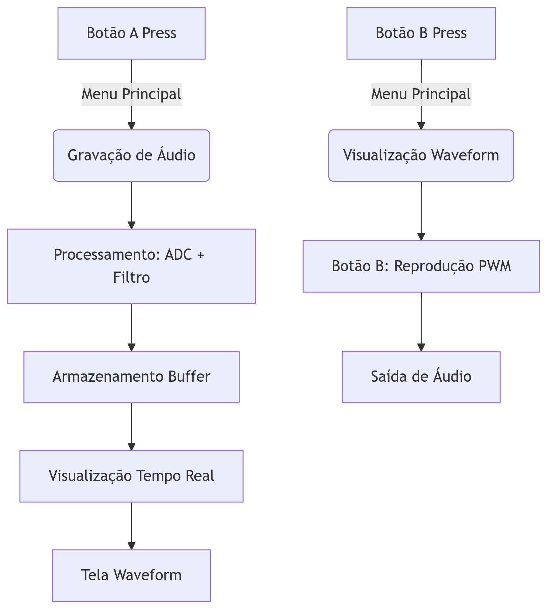

# Sintetizador de Áudio - EmbarcaTech 2025

**Autor:** Pedro Sampaio Dias Rocha  
**Curso:** Residência Tecnológica em Sistemas Embarcados  
**Instituição:** EmbarcaTech - HBr  
**Local:** Brasília  
**Data:** Junho de 2025  

---

## Introdução

Este projeto implementa um sintetizador de áudio completo utilizando a plataforma BitDogLab com microcontrolador RP2040. O sistema permite gravar sons através de um microfone, processar o sinal digitalmente e reproduzi-lo através de saída PWM com controle completo via interface física (botões) e visual (display OLED e LEDs RGB).

## 🎯 Funcionalidades Principais

- **Gravação de áudio**:
  - Taxa de amostragem de 22 kHz
  - Duração de 5 segundos
  - Filtro de média móvel para redução de ruído
  - Threshold para eliminação de ruído de fundo

- **Reprodução de áudio**:
  - Saída PWM com ganho ajustável
  - Suporte para alto-falante ou buzzer
  - Controle de volume digital

- **Interface de usuário**:
  - Display OLED 128x64 pixels
  - Menu interativo com navegação por botões
  - Visualização em tempo real da forma de onda
  - LED RGB para feedback de estado
  - Três telas distintas: Menu, Gravação e Visualização

- **Controles**:
  - Botão A: Iniciar gravação / Voltar ao menu
  - Botão B: Visualizar waveform / Reproduzir áudio

## 🔧 Diagrama de Funcionamento



## 🔌 Componentes e Conexões

| Componente       | GPIO  | Função               |
|------------------|-------|----------------------|
| Microfone        | ADC2  | Entrada de áudio     |
| PWM Speaker 1    | 21    | Saída de áudio       |
| PWM Speaker 2    | 10    | Saída de áudio       |
| Botão A          | 5     | Controle interface   |
| Botão B          | 6     | Controle interface   |
| LED Vermelho     | 13    | Indicador gravação   |
| LED Verde        | 11    | Indicador reprodução |
| LED Azul         | 12    | Indicador pronto     |
| OLED SDA         | 14    | Comunicação I2C      |
| OLED SCL         | 15    | Comunicação I2C      |

## 🧩 Estrutura do Código

### 📂 Módulos Principais

1. **audio.c**:
   - `init_audio_pwm()`: Configura hardware PWM
   - `record_audio()`: Captura áudio com filtragem
   - `play_audio()`: Reproduz áudio via PWM

2. **display.c**:
   - `core1_entry()`: Gerenciamento do display OLED
   - `draw_menu()`: Renderiza menu principal
   - `draw_recording()`: Mostra waveform em tempo real
   - `draw_waveform()`: Exibe waveform estático

3. **input.c**:
   - `init_input()`: Configura botões
   - `is_button_a_pressed()`: Leitura botão A
   - `is_button_b_pressed()`: Leitura botão B

4. **led.c**:
   - `set_rgb_led()`: Controle do LED RGB

5. **state.c**:
   - Gerencia estados globais e buffers

### ⚙️ Parâmetros Configuráveis

```c
// config.h
#define SAMPLE_RATE            22000     // Hz
#define SAMPLE_INTERVAL_US     (1000000 / SAMPLE_RATE)
#define AUDIO_DURATION         5         // segundos
#define BUFFER_SIZE            (SAMPLE_RATE * AUDIO_DURATION)
#define FILTER_WINDOW          5         // Tamanho janela média móvel
#define NOISE_THRESHOLD        50        // Valor mínimo para considerar áudio
#define VOLUME_GAIN            1.1f      // Ganho de reprodução
```

## 🧠 Técnicas Implementadas

1. **Amostragem de Áudio**:
   - Taxa de 22 kHz (acima do dobro da frequência máxima audível)
   - Média de 8 leituras por amostra para redução de ruído
   - Amostragem precisa usando temporização por hardware (`busy_wait_until`)

2. **Filtragem Digital**:
   - Filtro de média móvel com janela de 5 amostras
   - Threshold dinâmico para eliminação de ruído de fundo
   - Normalização do sinal após filtragem
   - Compensação de offset (remover valor base do ruído)

3. **Modulação PWM**:
   - Configuração de alta resolução (12 bits - 4096 níveis)
   - Dual PWM para saída balanceada
   - Controle de ganho aplicado durante reprodução
   - Proteção contra clipping (limitação de amplitude máxima)

4. **Gerenciamento de Memória**:
   - Buffer circular para armazenamento de amostras
   - Downsampling inteligente para visualização (128 pontos)
   - Alocação estática otimizada para evitar fragmentação
   - Proteção com mutex para acesso entre cores

5. **Interface Multithread**:
   - Core 0: Processamento de áudio em tempo real
   - Core 1: Renderização de interface gráfica
   - Sincronização via mutex para acesso ao display
   - Taxa de atualização de 20fps para interface

6. **Controle de Energia**:
   - Desligamento automático do PWM após reprodução
   - Controle seletivo de LEDs RGB por estado
   - Modo de baixo consumo entre operações

7. **Tratamento de Entrada**:
   - Debounce digital por timestamp
   - Leitura não-bloqueante de botões
   - Prevenção contra pressionamentos acidentais
   - Feedback tátil via LED

## 🛠️ Como Compilar e Executar

### Pré-requisitos
- Toolchain ARM para Raspberry Pi Pico (`gcc-arm-none-eabi`)
- SDK do Pico (pico-sdk)
- CMake (versão 3.12+)
- Git (para controle de versão)

### Passos de Compilação
```bash
git clone https://github.com/seu-usuario/sintetizador-audio.git
cd sintetizador-audio
mkdir build
cd build
cmake -DPICO_SDK_PATH=/caminho/para/pico-sdk ..
make -j4
```

### Carregamento na Placa
1. Mantenha pressionado o botão `BOOT` da Raspberry Pi Pico
2. Conecte a placa ao computador via USB
3. Solte o botão `BOOT`
4. Copie o arquivo `sintetizador_audio.uf2` para a unidade `RPI-RP2`
5. A placa reiniciará automaticamente e executará o programa

## 💭 Reflexão Final

### Técnicas para Melhoria
1. **Buffer Duplo**:
   - Permitir gravação contínua enquanto processa amostras anteriores
   - Eliminar gaps entre gravações consecutivas

2. **Compressão ADPCM**:
   - Reduzir consumo de memória em 50-70%
   - Permitir gravações mais longas sem perda perceptível

3. **DMA (Acesso Direto à Memória)**:
   - Liberar CPU durante transferências de áudio
   - Garantir timing preciso de amostragem

4. **Filtros IIR/BIQUAD**:
   - Implementar equalização paramétrica
   - Filtro notch para eliminar ruídos específicos
   - Pré-ênfase para melhorar inteligibilidade vocal

5. **Reconhecimento de Voz**:
   - Detecção de comandos simples (start/stop)
   - Ativação por palavra-chave

### Desafios para Gravações Extensas
Para implementar gravações mais longas mantendo qualidade:

| Desafio                  | Solução Proposta                          | Benefício                           |
|--------------------------|-------------------------------------------|-------------------------------------|
| Memória limitada         | Uso de cartão SD via SPI                  | Capacidade de GBs de armazenamento  |
| Processamento intensivo  | Compressão Opus (8-16 kbps)              | Redução de 80-90% no tamanho        |
| Consumo de energia       | Sleep mode entre amostras                 | Economia de bateria                 |
| Qualidade de voz         | Taxa de amostragem adaptativa (8-16 kHz)  | Balanceamento qualidade/eficiência  |
| Ruído em gravações longas| Filtro adaptativo LMS                     | Redução de ruído em tempo real      |

### Conclusão
Este projeto demonstra com sucesso os princípios fundamentais de processamento de áudio digital em sistemas embarcados, desde a aquisição do sinal analógico até sua reprodução com qualidade. A implementação atual serve como base para diversas expansões:

- **Aplicações educacionais**: Ótima ferramenta para ensino de DSP
- **Dispositivos IoT**: Gravação e transmissão de áudio remoto
- **Sistemas de segurança**: Detecção de eventos sonoros
- **Instrumentos musicais**: Sintetizadores digitais avançados

O código está estruturado para facilitar melhorias futuras, com módulos bem definidos e parâmetros facilmente ajustáveis.

---

## 📜 Licença

GNU GPL-3.0.
